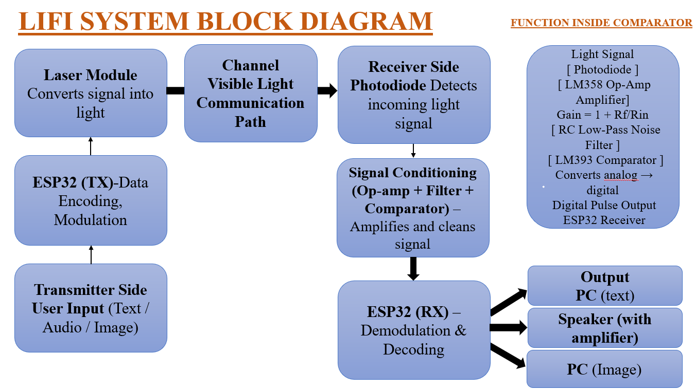
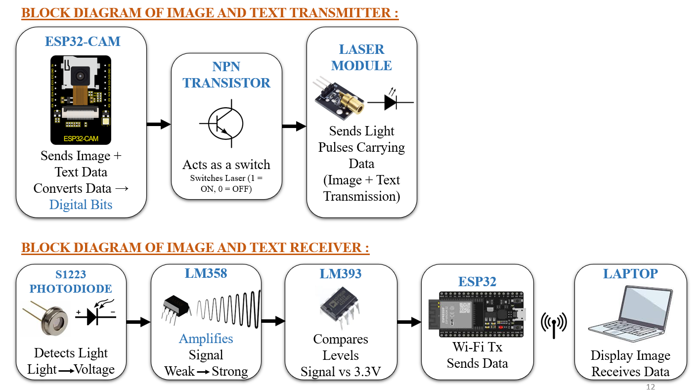
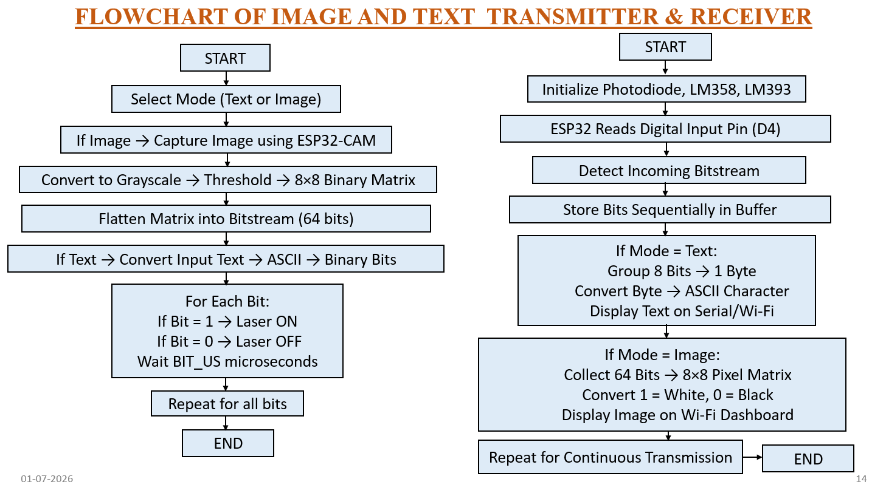
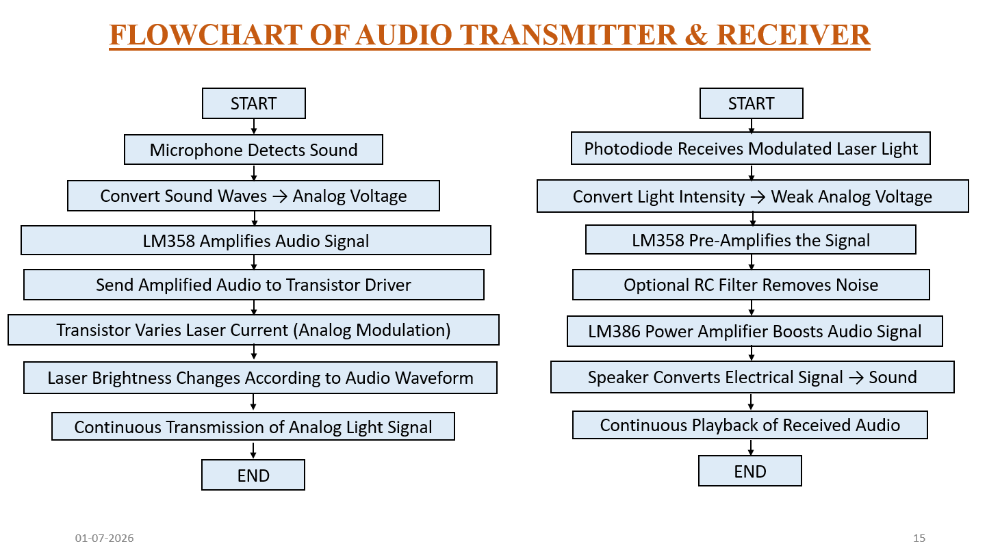
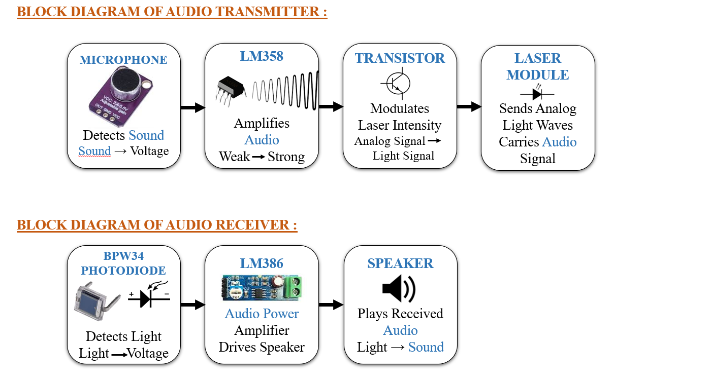

# Project Diagrams

This folder contains all system architecture diagrams and flowcharts for the **ILLUMICOMM Li-Fi Communication System**.

---

## Overall System Architecture

### Main System Block Diagram

---

## Image and Text Communication Module

### Image and Text Transmitter & Receiver Block Diagram

### Image and Text Transmission Flowchart

### Image and Text Receiver Flowchart

---

## Audio Communication Module

### Audio Communication Block Diagram

---

## Experimental Workflow

The project demonstrates Li-Fi based communication using **Visible Light Communication (VLC)** technology for three communication modes:

- Text Transmission  
- Image Transmission  
- Audio Transmission  

The transmitter converts electrical signals into optical light pulses, while the receiver detects light intensity variations and reconstructs the transmitted data.

---

## Note

All diagrams represent the implementation of Li-Fi based communication using optical transmission instead of conventional RF communication.
