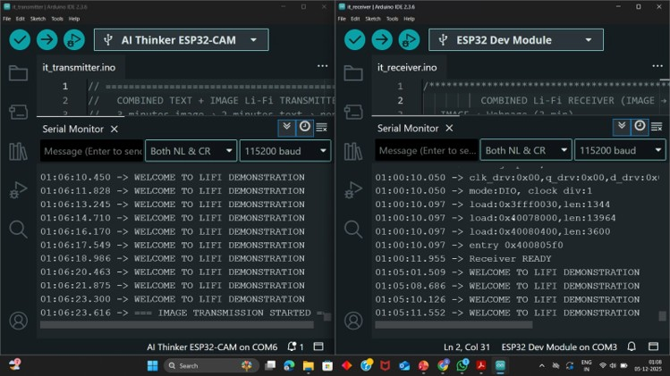
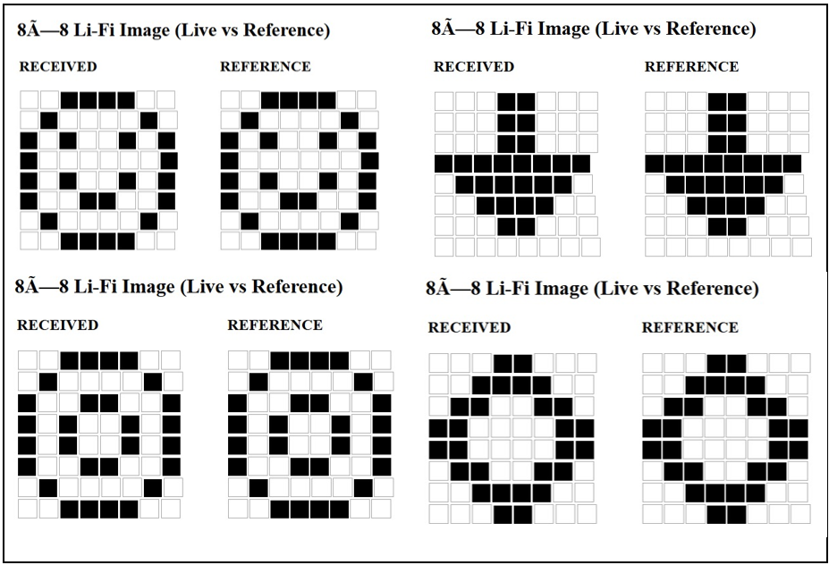
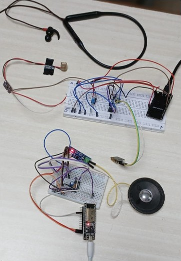

# Experimental Test and Results

This folder contains experimental testing, validation procedures, and performance analysis of the **ILLUMICOMM Li-Fi Communication System**.

---

## 1. Text Transmission Test

### Objective

To verify successful transmission of text data through Li-Fi based optical communication.

### Experimental Procedure

- Text message was encoded into ASCII binary data by ESP32 transmitter.  
- Binary data was transmitted through laser using ON-OFF Keying (OOK).  
- Receiver photodiode detected incoming optical pulses.  
- LM358 and LM393 processed the received signal.  
- ESP32 receiver decoded the received data.

### Result

- Text data was transmitted successfully.  
- Receiver decoded data accurately.  
- Output was displayed correctly on laptop serial monitor.  

### Experimental Output

### Status

✅ Successful

---

## 2. Image Transmission Test

### Objective

To verify image data transmission using Visible Light Communication.

### Experimental Procedure

- Predefined **8×8 binary image** was stored inside transmitter ESP32.  
- Image pixels were converted into binary bitstream.  
- Laser transmitted image data through optical pulses.  
- Receiver detected binary pulses using photodiode circuit.  
- ESP32 receiver reconstructed image matrix.

### Result

- Image data transmitted successfully.  
- Receiver reconstructed image accurately.  
- Image displayed correctly on laptop webpage.  

### Experimental Output

### Status

✅ Successful

---

## 3. Audio Transmission Test

### Objective

To test analog audio communication through optical laser modulation.

### Experimental Procedure

- Microphone captured analog audio signal.  
- LM358 amplified the weak microphone signal.  
- Laser intensity varied according to audio waveform.  
- Photodiode detected light intensity variations.  
- LM386 amplified recovered signal for speaker output.

### Result

- Audio signal transmitted successfully.  
- Receiver detected optical analog signal correctly.  
- Speaker reproduced audio with minimal distortion.  

### Experimental Output

### Status

✅ Successful

---

## 4. Distance and Stability Test

### Objective

To analyze communication stability over transmission distance.

### Observation

- System tested at **30 cm line-of-sight distance**.  
- Optical communication remained stable during testing.  
- Low signal noise observed during transmission.  
- Signal decoding remained consistent under controlled alignment.

### Result

Reliable short-range communication achieved.

### Status

✅ Stable Performance

---

## 5. Overall System Performance

The project successfully demonstrated:

- Text communication using optical transmission  
- Image communication using Li-Fi system  
- Audio communication using analog laser modulation  
- Multi-modal Li-Fi communication architecture  
- Secure and interference-free short range communication  
- Visible Light Communication (VLC) based wireless transmission  

---

## Performance Summary

| Parameter | Result |
|------------|--------|
| Text Transmission | Successful |
| Image Transmission | Successful |
| Audio Transmission | Successful |
| Transmission Distance | 30 cm |
| Signal Stability | Stable |
| Communication Medium | Visible Light |

---

## Conclusion

The **ILLUMICOMM Li-Fi Communication System** successfully demonstrated wireless communication completely through **Visible Light Communication (VLC)** technology.

The system proved capable of transmitting **text, image, and audio data** entirely through optical communication, demonstrating the future potential of Li-Fi as a secure, high-speed, interference-free alternative to conventional RF wireless communication.
